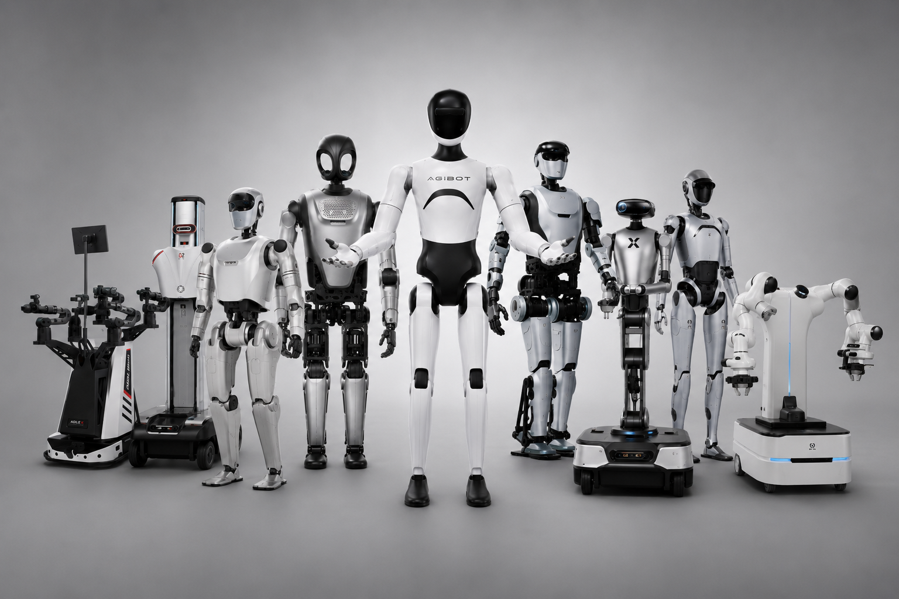

<p align="center">
  
</p>


<h1 align="center">🤖 Hello VLA</h1>


<p align="center">
  <em>快速了解 VLA，跟进前沿研究方向</em>
</p>

<p align="center">
  <strong>It’s amazing what you can learn if you’re not afraid to try.</strong>
</p>

<p align="right">
  <sub><em><font color="#8a8f98">—— Robert A. Heinlein, Have Space Suit–Will Travel</font></em></sub>
</p>


---

</div>


## 写在前面

实践永远是最好的老师。即使是刚刚接触一个领域，我认为最快的学习方式也是先动手实践，再在实践过程中不断补充知识，而不是等到拥有“完美”的知识储备后再开始。

VLA 和世界模型是当前比较热门的研究方向，但面对大量论文和 Awesome 仓库，初学者往往很难判断应该从哪里开始。在这里，我会分享自己阅读过的论文、实践过的项目，以及对它们的理解。

当然，这些内容都带有一定的主观性。如果有错误的地方，欢迎大家纠正；如果你有更好的想法，也欢迎联系我。

📧：[yirongzzz@163.com](mailto:yirongzzz@163.com)


## 📋 目录

| 章节                                 | 描述                                 |
| ------------------------------------ | ------------------------------------ |
| [🚀 快速开始](#-快速开始)             | 帮助初学者快速建立 VLA 认知          |
| [💐 多源数据预训练](#-多源数据预训练) | 多源数据的组织方式与训练 recipe      |
| [🧠 VLA & Memory](#-vla--memory)      | 短期记忆与长期记忆如何辅助长时程任务 |
| [💪 VLA & RL](#-vla--rl)              | 强化学习提升模型的鲁棒性             |
| [📓 VLA & Subtask](#-vla--subtask)    | subtask 如何辅助模型学习与任务执行   |
| [🌍 VLA & 世界模型](#-vla--世界模型)  | 基于世界模型的辅助高层语义规划       |


## 🚀 快速开始

VLA 对于 VLM, LM, CV, NLP 来说，比较简单的思考就是换了输入和输出格式

一个机器人完成任务需要什么信息呢？

* image observation：机器人当前看到了什么，包括目标物体、周围环境以及物体之间的空间关系
* instruction：命令指令，机器人需要完成什么任务
* Robot state：机器人当前处于什么状态，例如各关节的位置、末端执行器位姿和夹爪状态。

机器人怎么行动？

* action：输出的是末端位姿的增量变化 ~~接着通过逆运动学转化为 base frame（基座）坐标系变化~~

可以简单表示为：

```
Image Observation + Instruction + Robot State
                         │
                         ▼
                        VLA
                         │
                         ▼
                       Action
```

尽管当前通用 VLA 的效果还不够理想，但也已经形成了比较成熟的架构范式：**VLM + Action expert** （Action expert 用于生成动作）。当前比较成熟的两种架构：1. 串联结构； 2. MoT架构（Mixture of Transformer）


### 串联结构

架构可以概括为：

```
Image + Instruction + Robot State
                │
                ▼
               VLM
                │
                ▼
      Multimodal Representations
                │
       + Initial Action Noise
                │
                ▼
            Action Head
                │
                ▼
           Action Chunk （action chunk 可以理解为 H 步的 action变化）
```

**代表作**

* 【2026】SimVLA: A Simple VLA Baseline for Robotic Manipulation [](https://arxiv.org/pdf/2602.18224)

> 这是本人接触 vla 工作中第一篇复现的论文，结构比较简单，也很适合大部分新手。 这项工作的动机也比较明确，在此前许多工作的模块耦合，很难区分是哪个模块起作用了，因此提出了 SIMVLA 的基线模型。
>
> **VLM**：SmolVLM-0.5B
> **Action Head**： Transformer encoder


### MOT

另一种比较经典的架构是MOT

```
Image + Instruction                    Robot State + Noisy Actions
          │                                      │
          ▼                                      ▼
   VLM Transformer                         Action Expert
       Layer 1          ◄── Attention ──►      Layer 1
          │                                      │
          ▼                                      ▼
   VLM Transformer                         Action Expert
       Layer 2          ◄── Attention ──►      Layer 2
          │                                      │
         ...                                    ...
          │                                      │
          ▼                                      ▼
   VLM Transformer                         Action Expert
       Layer N          ◄── Attention ──►      Layer N
                                                 │
                                                 ▼
                                      Predicted Action Velocity
                                                 │
                                          Flow Matching
                                                 │
                                                 ▼
                                           Action Chunk
```

**代表作**

* 【2024】π0: A Vision-Language-Action Flow Model for General Robot Control [](https://arxiv.org/pdf/2410.24164v1)


### 📊 数据格式

目前在 LeRobot、OpenPI 等机器人学习框架中，**LeRobotDataset** 是一种常见的标准化数据格式。

* 目录结构

```
dataset/
├── data/
│   └── chunk-000/
│       └── file-000.parquet
│
├── videos/
│   └── observation.images.camera/
│       └── chunk-000/
│           └── file-000.mp4
│
└── meta/
    ├── info.json
    ├── tasks.jsonl
    ├── stats.json
    └── episodes/
        └── chunk-000/
            └── file-000.parquet
```

从逻辑上看，机器人数据集可以表示为：

```
Dataset
├── Episode 0
│   ├── Frame 0
│   │   ├── observation.images.*
│   │   ├── observation.state
│   │   ├── action
│   │   ├── timestamp
│   │   ├── frame_index
│   │   ├── episode_index
│   │   ├── task_index
│   │   └── 【UNKNOWN】补充需要的信息
│   ├── Frame 1
│   └── ...
├── Episode 1
└── ...
```


**复现推荐：**

数据集

* LIBERO: https://github.com/Lifelong-Robot-Learning/LIBERO

代码：

1. SimVLA：https://github.com/LUOyk1999/SimVLA
2. Openpi：https://github.com/Physical-Intelligence/openpi
3. Rlinf 框架：https://rlinf.readthedocs.io/en/latest/rst_source/examples/embodied/pi0.html


在复现过程中，可以查看数据的格式，关注 LIBERO 上的评测结果，包括不同任务的成功率、失败案例，以及策略执行时生成的可视化视频。相比只观察训练 loss，这些结果能够更直观地反映模型是否真正学会了对应的操作任务。

目前来看，VLA 在长时程任务和通用化方面仍有很长的路要走。现有研究大多仍基于类似的整体架构，只是在训练 recipe、预训练或强化学习等方面进行改进。因此，我认为只要完整复现一套主流 VLA 方法，就能对这个方向建立比较清晰的认识。


## 💐 多源数据预训练

> [!note]
>
> 与互联网图文数据相比，机器人数据天然具有较强的异构性。不同数据集可能使用不同数量和位置的相机，记录不同形式的机器人状态，并采用完全不同的动作空间。例如，有些机器人预测关节位置，有些机器人预测末端执行器位姿；不同数据集的动作维度、坐标系、控制频率和 Action Chunk 长度也可能不同。如何对多源机器人数据进行统一表示、构建能够兼容不同机器人本体和数据分布的训练 recipe，成为当前通用 VLA 研究中的重要方向。

* 【2026】Qwen-VLA: Unifying Vision-Language-Action Modeling across Tasks [](https://arxiv.org/pdf/2605.30280)

> 💡 论文有个有意思的 recipe：先训练 instruction-action 的阶段，没有 image 作为 input，有点像阿里的LA4VLA 的思想；

* 【2026】Green-VLA: Staged Vision-Language-Action Model for Generalist Robots [](https://arxiv.org/abs/2602.00919)
* 【2026】A Pragmatic VLA Foundation Model [](https://arxiv.org/pdf/2601.18692)
* 【2025】π0.5: a Vision-Language-Action Model with Open-World Generalization [](https://arxiv.org/abs/2504.16054)


## 🧠 VLA & Memory

> [!note]
>
> 目前 VLA 比较常见的输入形式是 `image + instruction + state`。这种输入虽然简洁，但在真实机器人任务里容易带来两个问题：
>
> 1. 模型不知道自己之前做过什么，难以处理依赖历史状态的任务。
> 2. 当前帧可能被机械臂、物体或视角变化遮挡，单帧观测不足以支持稳定决策。
>
> 基于这些问题，研究者开始把不同形式的 memory 引入 VLA 或机器人策略中。

- 【2025】**MemoryVLA: Perceptual-Cognitive Memory in Vision-Language-Action Models for Robotic Manipulation** [](https://arxiv.org/pdf/2508.19236)

> **Motivation:** 许多机器人操作任务本质上不是 Markov 的，仅依赖当前观测很难判断任务进度。例如按钮是否已经按过、抽屉是否已经打开、某个阶段是否已经完成，这些都需要历史上下文。主流 VLA 往往缺少明确的时间记忆，因此在长程、强时序依赖任务中容易失败。
>
> **Method:** 文章提出 `MemoryVLA`，一个 Cognition-Memory-Action 框架。它用预训练 VLM 将当前观测编码成 perceptual tokens 和 cognitive tokens，作为 working memory；再通过 Perceptual-Cognitive Memory Bank 保存低层视觉细节和高层语义信息。决策时，working memory 会从 memory bank 中检索与当前任务相关的历史信息，并与当前 tokens 自适应融合，最后交给 memory-conditioned diffusion action expert 生成动作序列。同时，memory bank 会合并冗余信息，避免长期记忆无限增长。
>
> **Takeaway:** `MemoryVLA` 的核心是把短期工作记忆和长期感知-认知记忆结合起来，让 VLA 能在长程操作中理解“之前发生过什么”。

- 【2026】**ReMem-VLA: Empowering Vision-Language-Action Model with Memory via Dual-Level Recurrent Queries** [](https://arxiv.org/pdf/2603.12942)

> **Motivation:** 现有 VLA 通常基于 Markov 假设，或者只把有限历史帧拼到输入里。这种方式要么容易受到 memory bank 中无关信息干扰，要么受固定窗口长度限制，无法稳定保留长时间上下文。作者希望在不显著增加训练和推理成本的情况下，为 VLA 加入可端到端学习的记忆机制。
>
> **Method:** 这篇提出的方法还挺有意思，因为不同eposide的长度不同，为了防止batch的截断，提出了slot-based的训练方法；为了能够不仅仅是基于当前观察$o_t$输出action chunk，通过一个双向注意力的transformer与短期记忆和长期记忆的query计算，输出action chunk；除此之外，作者还加入 Past Observation Prediction 辅助训练目标，让模型通过预测过去观测来强化视觉记忆。
>
> **推荐指数**：🌟🌟

- 【2026；Physical Intelligence】**MEM: Multi-Scale Embodied Memory for Vision Language Action Models** [](https://arxiv.org/pdf/2603.03596v1)

> **Motivation:** 真实长程机器人任务需要不同粒度的记忆：短期记忆用于补偿最近几秒的遮挡和动作连续性，长期记忆用于记录更抽象的任务阶段，例如“已经完成了哪一步”。只输入固定长度的视频帧无法同时满足这两类需求，既容易丢失长期语义，又会带来很高的计算成本。
>
> **Method:** 文章将记忆分为短期记忆和长期记忆。短期记忆方面，作者设计了一个高效的视频编码器，在标准 ViT 上扩展视频输入：交替使用 observation 内部的双向空间注意力和跨 observation 的因果时间注意力，并在 ViT 上层丢弃过去时间步的 observation tokens，从而压缩短时视频记忆并减少传入 VLA backbone 的 token 数量。长期记忆方面，模型通过预测 subtask 表示当前任务阶段，并将已完成的 subtask 拼接回输入，作为后续动作预测的长期上下文。最终，模型结合短期视频记忆、长期 subtask 记忆和当前指令来预测 action chunk。
>
> **推荐指数:** 🌟🌟🌟


## 💪 VLA & RL

* 【2026】Hy-Embodied-0.5-VLA: From Vision-Language-Action Models to a Real-World Robot Learning Stack [](https://arxiv.org/pdf/2606.14409v1)

* 【2026】Qwen-VLA: Unifying Vision-Language-Action Modeling across Tasks [](https://arxiv.org/pdf/2605.30280)

* 【2025】$\pi^*$0.6 : a VLA That Learns From Experience [](https://arxiv.org/pdf/2511.14759)、

> **Motivation**：如何让一个 VLA 在部署后继续从自己的执行经验中学习和改进
>
> **Method**：提出 Recap：设计 reward & return -> 训练 value function -> 设计优势函数 -> 训练CFG
>
> **推荐指数:** 🌟🌟🌟（It’s amazing what you can learn if you’re not afraid to try，这是我最喜欢的一句话）

* 【2025】GR-RL: Going Dexterous and Precise for Long-Horizon Robotic Manipulation [](https://arxiv.org/pdf/2512.01801)

> **Motivation:** 现有 VLA 通常采用行为克隆进行训练，默认人类示范中的所有动作都是最优的。然而，在长时程、高精度的操作任务中，人类示范往往包含犹豫、停顿、重复尝试和无效调整等次优行为。行为克隆会不加区分地拟合这些动作，从而限制策略的精度与执行效率。
>
> **Method：** GR-RL 首先基于带有稀疏奖励的离线强化学习训练 Q-function，并将得到的 Q-value 作为任务进度函数，用于判断每个 transition 是否真正推动了任务向成功方向发展。随后，模型过滤掉对任务进度贡献较小或产生负面影响的动作，仅保留具有正向进度训练 VLA Policy。
>
> **推荐指数:** 🌟🌟 （方法上可行，但是鄙人认为 failure episode 和 success episode 会有重叠部分，这部分可能会导致模型训练矛盾？）

* 【2025; NVIDIA】**ThinkAct: Vision-Language-Action Reasoning via Reinforced Visual Latent Planning **[](https://arxiv.org/pdf/2507.16815)

> **Motivation:** 作者认为现有 VLA 模型多为端到端训练，缺少显式推理模块，导致模型难以进行多步规划和处理复杂任务。
>
> **Method:** 基于这一动机，论文将 VLM 的输出向量编码为轨迹表示，并利用 GRPO 对多个 image embedding 进行强化训练，引导高层视觉潜在规划。
>
> **推荐指数:** 🌟 （文章在方法部分提到模型输出高层推理潜向量 $v_t$，但未对该向量的训练方式进行说明，因此其实际贡献和 novelty 较为有限。）


## 📓 VLA & Subtask

> [!NOTE]
>
> 当前 VLA 模型接收到的 instruction 通常只是对任务目标的一句简短描述，例如“把衣服叠好”或“将物体放入抽屉”。然而，一个完整任务的执行往往包含多个具有先后依赖关系的操作阶段，仅依赖这种高度概括的指令，难以为模型提供足够细粒度的过程指导。因此，模型不仅需要理解 instruction 所描述的最终目标，还需要进一步将其分解为一系列可执行的子任务，并根据当前观测判断所处的任务阶段以及下一步应该完成的操作。

* 【2026】**LA4VLA: Learning to Act without Seeing via Language-Action Pretraining** [](https://arxiv.org/pdf/2606.27295)

> **Motivation:** 认为目前的 action manipulation 主要被视觉信息主导， instruction 只占有少量的 token
>
> **Method**：将 episode 进行关键帧识别以及 subtask 分配，构建一个 subtask 预训练数据集，并实现`LA-VLA`的预训练范式
>
> **推荐指数:** 🌟🌟🌟 

* 【2026；Physical Intelligence】**MEM: Multi-Scale Embodied Memory for Vision Language Action Models** [](https://arxiv.org/pdf/2603.03596v1)

> **Motivation:** 真实长程机器人任务需要不同粒度的记忆：短期记忆用于补偿最近几秒的遮挡和动作连续性，长期记忆用于记录更抽象的任务阶段，例如“已经完成了哪一步”。只输入固定长度的视频帧无法同时满足这两类需求，既容易丢失长期语义，又会带来很高的计算成本。
>
> **Method:** 模型通过预测 subtask 表示当前任务阶段，并将已完成的 subtask 拼接回输入，作为后续动作预测的长期上下文。最终，模型结合短期视频记忆、长期 subtask 记忆和当前指令来预测 action chunk。
>
> **推荐指数:** 🌟🌟🌟

* 【2026】ProcVLM: Learning Procedure-Grounded Progress Rewards for Robotic Manipulation [](https://arxiv.org/pdf/2605.08774)

> **Method:** 文章介绍了自动化标注一段视频 keyframe 以及 subtask 的标注
>
> **推荐指数:** 🌟🌟


## 🌍 VLA & 世界模型

* 【2026】π0.7: a Steerable Generalist Robotic Foundation Model with Emergent Capabilities [](https://arxiv.org/pdf/2604.15483)
* 【2026】World-Language-Action Model for Unified World Modeling, Language Reasoning, and Action Synthesis [](https://arxiv.org/pdf/2606.05979)
* 【2025】 WorldVLA: Towards Autoregressive Action World Model [](https://arxiv.org/abs/2506.21539) 

* 【2025】 RynnVLA-002: A Unified Vision-Language-Action and World Model [](https://arxiv.org/pdf/2511.17502)


## 💡 VLA & REASONING

* 【2025】EO-1: An Open Unified Embodied Foundation Model for General Robot Control [](https://arxiv.org/pdf/2508.21112)
